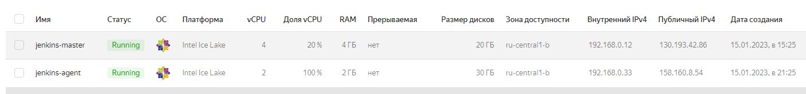
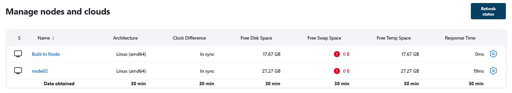
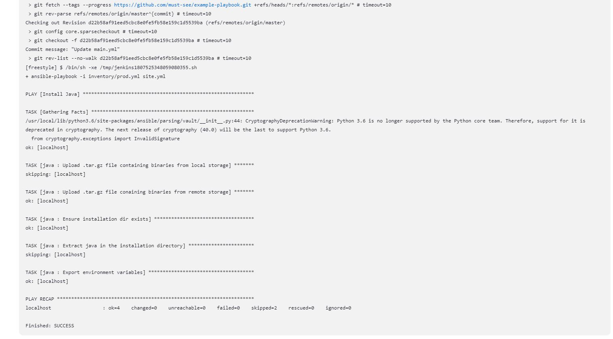
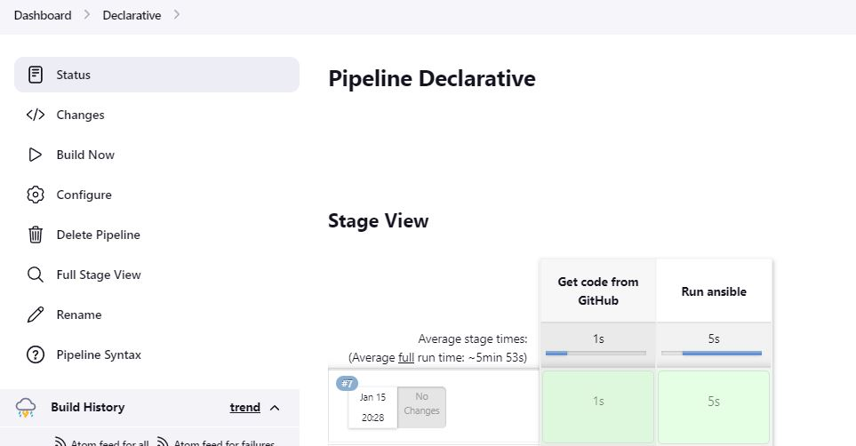
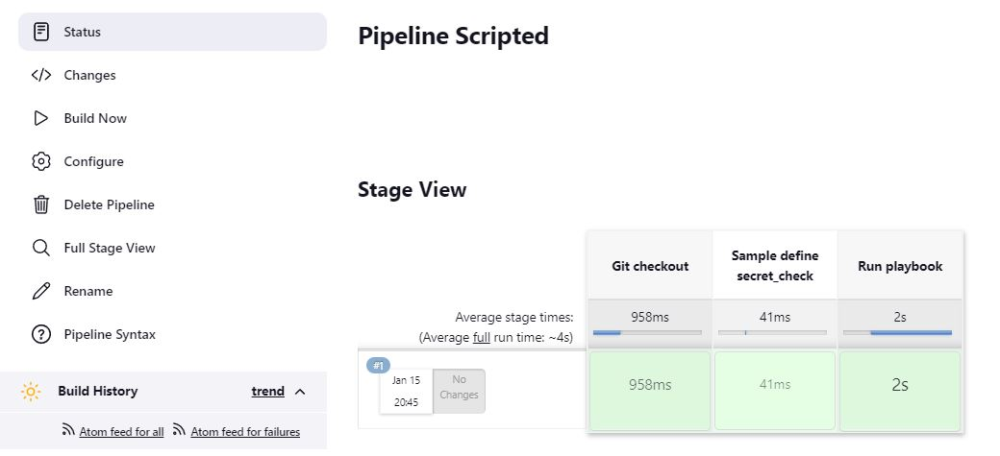
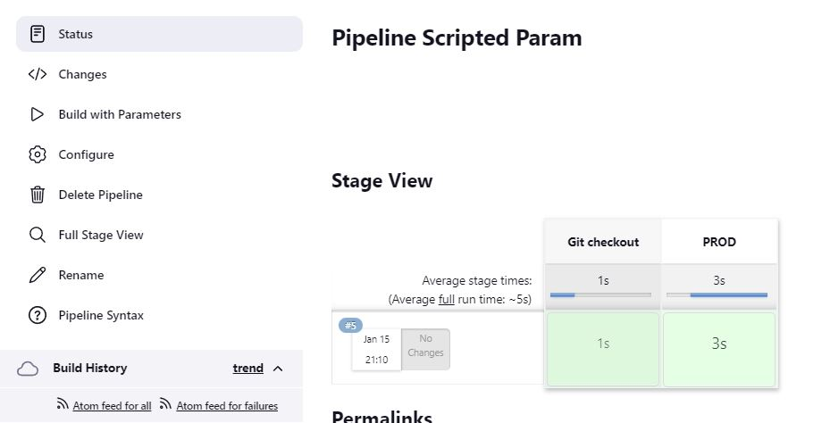
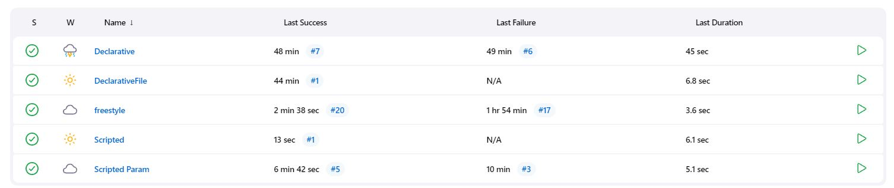

# Домашнее задание к занятию "09.04 Jenkins"

## Подготовка к выполнению

1. Создать 2 VM: для jenkins-master и jenkins-agent.
2. Установить jenkins при помощи playbook'a.
3. Запустить и проверить работоспособность.
4. Сделать первоначальную настройку.





## Основная часть

1. Сделать Freestyle Job, который будет запускать `ansible-playbook` из любого вашего репозитория с ролью.
```commandline
ansible-playbook -i inventory/prod.yml site.yml
```

2. Сделать Declarative Pipeline Job, который будет запускать `ansible-playbook` из любого вашего репозитория с ролью.
```commandline
pipeline {
  agent any
  stages {
      stage('Get code from GitHub') {
          steps {
              // Get some code from a GitHub repository
              git credentialsId: 'e90513a4-32a7-4fea-afdc-b7f16f6834d7', url: 'https://github.com/must-see/example-playbook.git'
          }
      }
      stage('Run ansible') {
          steps {
              sh 'ansible-playbook -i inventory/prod.yml site.yml'
          }
      }
  }
}
```

3. Перенести Declarative Pipeline в репозиторий в файл `Jenkinsfile`.
- [Jenkinsfile](https://github.com/must-see/example-playbook/blob/3f6b60a8c1ebc4bba804017c54b5ab868021a4c1/Jenkinsfile)


5. Создать Multibranch Pipeline на запуск `Jenkinsfile` из репозитория.
6. Создать Scripted Pipeline, наполнить его скриптом из [pipeline](./pipeline).
```commandline
node("centos"){
    stage("Git checkout"){
        git credentialsId: 'e90513a4-32a7-4fea-afdc-b7f16f6834d7', url: 'https://github.com/must-see/example-playbook.git'
    }
    stage("Sample define secret_check"){
        secret_check=true
    }
    stage("Run playbook"){
        if (secret_check){
            sh 'ansible-playbook site.yml -i inventory/prod.yml'
        }
        else{
            echo 'need more action'
        }
        
    }
}
```


7. Внести необходимые изменения, чтобы Pipeline запускал `ansible-playbook` без флагов `--check --diff`, если не установлен параметр при запуске джобы (prod_run = True), по умолчанию параметр имеет значение False и запускает прогон с флагами `--check --diff`.
```commandline
node("centos"){
    stage("Git checkout"){
        git credentialsId: 'e90513a4-32a7-4fea-afdc-b7f16f6834d7', url: 'https://github.com/must-see/example-playbook.git'
    } 
    def is_prod = "${env.prod_run}"
    if (is_prod == "true"){
    stage("Prod"){
        sh 'ansible-playbook site.yml -i inventory/prod.yml'
    } 
    }
    else{
    stage("Test"){
            sh 'ansible-playbook site.yml -i inventory/prod.yml --check --diff'
        }
    }
}
```


8. Проверить работоспособность, исправить ошибки, исправленный Pipeline вложить в репозиторий в файл `ScriptedJenkinsfile`
- [ScriptedJenkinsfile](https://github.com/must-see/example-playbook/blob/654305781c42b40b251dbf36558a8c9e3434a308/ScriptedJenkinsfile)
9. Отправить две ссылки на репозитории в ответе: с ролью и Declarative Pipeline и c плейбукой и Scripted Pipeline.

- [example-playbook](https://github.com/must-see/example-playbook.git)



## Необязательная часть

1. Создать скрипт на groovy, который будет собирать все Job, которые завершились хотя бы раз неуспешно. Добавить скрипт в репозиторий с решеним с названием `AllJobFailure.groovy`.
2. Дополнить Scripted Pipeline таким образом, чтобы он мог сначала запустить через Ya.Cloud CLI необходимое количество инстансов, прописать их в инвентори плейбука и после этого запускать плейбук. Тем самым, мы должны по нажатию кнопки получить готовую к использованию систему.

---

### Как оформить ДЗ?

Выполненное домашнее задание пришлите ссылкой на .md-файл в вашем репозитории.

---