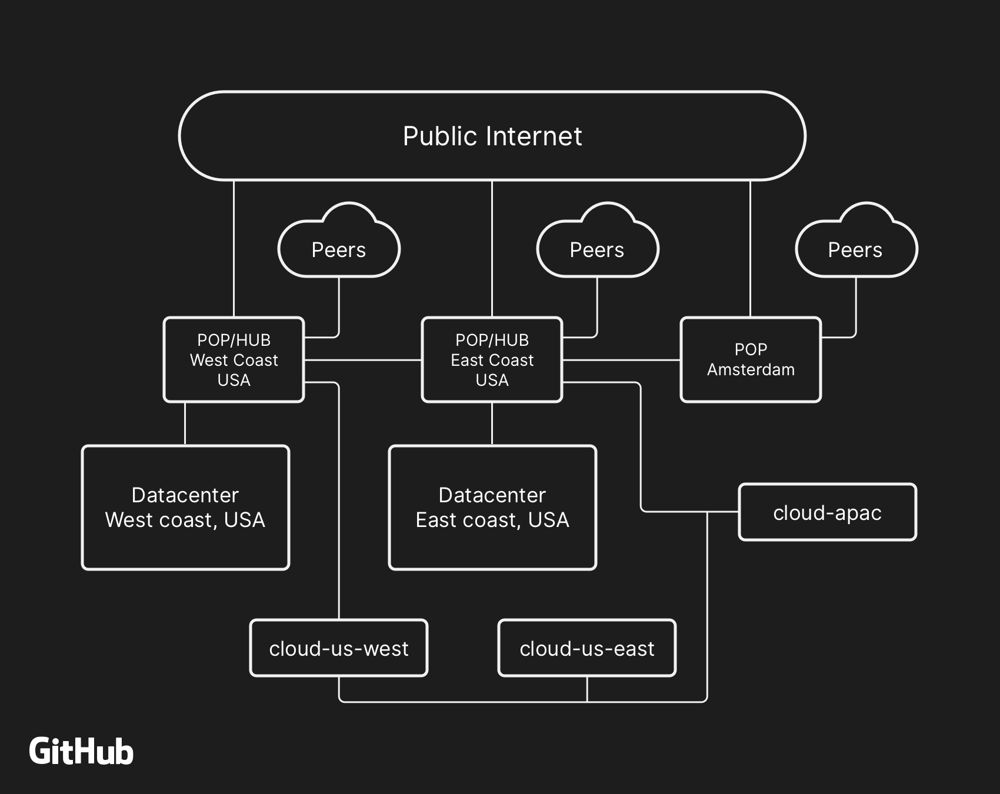
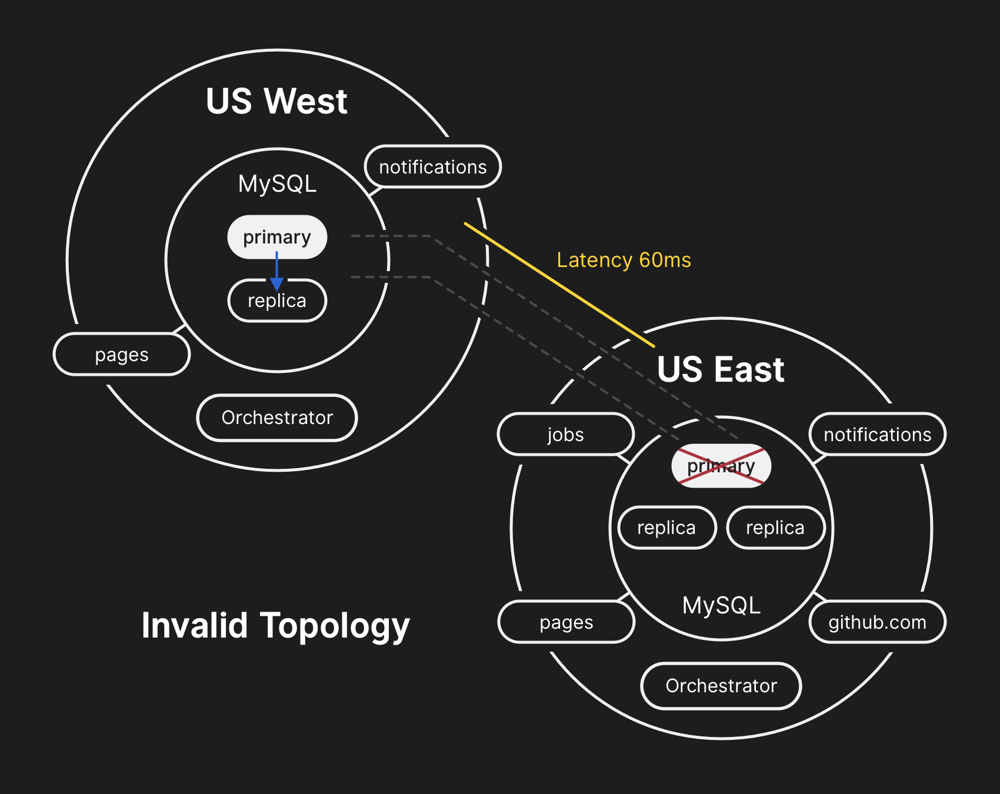
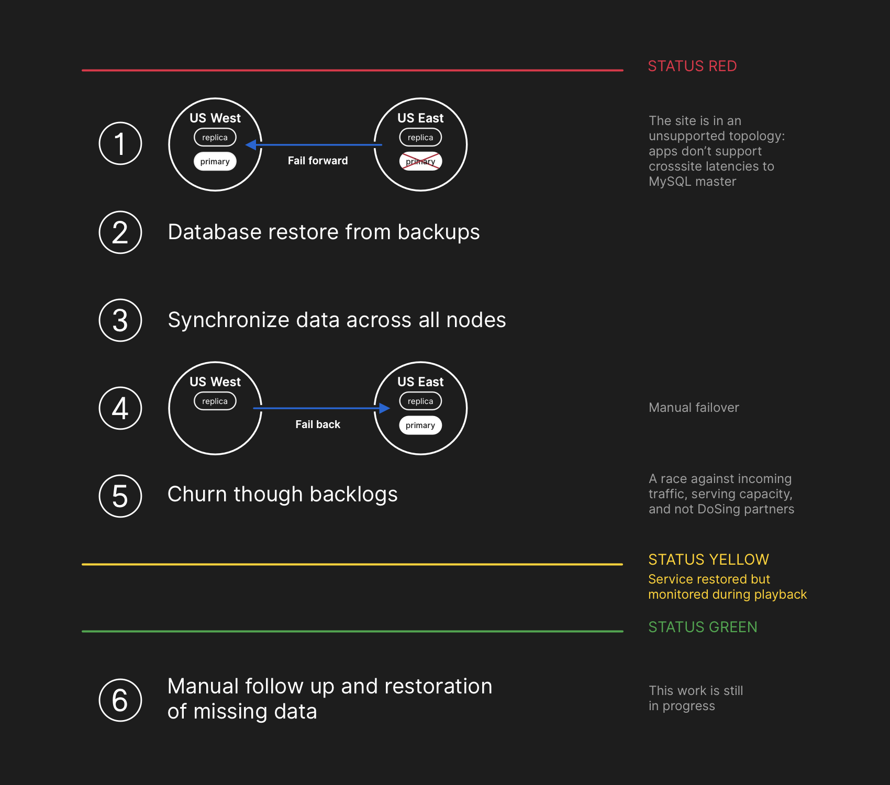

# Домашнее задание к занятию "10.06. Инцидент-менеджмент"

## Задание 

Составьте постмортем, на основе реального сбоя системы Github в 2018 году.

Информация о сбое доступна [в виде краткой выжимки на русском языке](https://habr.com/ru/post/427301/) , а
также [развёрнуто на английском языке](https://github.blog/2018-10-30-oct21-post-incident-analysis/).

---

### Краткое описание инцидента

В 22:52 21 октября 2018 были затронуты некоторые службы GitHub в связи с проблемой на сетевых разделах и последущего сбоя на БД. В результатае возникла несогласованность информации на сервисах (данных) и наблюдали устаревшую или неполную информацию на сайте GitHub.com. 
В период восстановления хостинга в работу, команде проекта пришлось остановить работу веб-хуков, что так же могло доставлять пользователям неудобства.

### Предшествующие события

Плановые ремонтные работы по замене неисправного оптического оборудования 100G привели к потере связи на 43сек между сетевым узлом US East Coast и основным дата-центром US East Coast.

### Причина инцидента

Основная причина - неверная в рамках инфраструктуры настройка репликатора MySQL - orchestrator. Тригером инцидента послужила потеря связности между ядром сети (network hub) и основным датацентром на восточном побережье США. Связность была восстановлена через 43 секунды, но это запустило цепочку событий, в результате которых развалились кластеры БД и привело к ухуждению качества ослуживания.

### Воздействие

В течение 24 часов и 11 минут 100% пользователей испытывали проблемы при работе с сайтом: не работали Issues, Webhooks, недоступность работы страниц GitHub, на сайте отображалась устаревшая или неполная информация.

### Обнаружение

В 22:54 система мониторинга начала отсылать алёрты с ошибками в системе. В 23:02 дежурные инженеры определили, что множество кластеров баз данных находились в неожиданном состоянии.

### Реакция

Деградация сервиса в течении 24 часов и 11 минут. Группа реагирования вручную перевели систему в статус желтый в 23:09 и был подключен координатор по инцидентам. Далее изменил статус сервиса на красный в 23:11.

### Восстановление

Восстановление полной производительности было выполнено за счет восстановления данных из бэкаповх и повторных репликаций всех имеющихся данных с хостов с актуальными данными для восстановления 100% целостности данных во всех кластерах хранения данных.

### Таймлайн

* 2018 October 21 22:52 UTC: во время падения сети, развалился кластер БД. После восстановления была попытка восстановления целостности кластера, восстановления консенсуса, но данные в БД различялись, что привело к несогласованности в рамках кластера
* 2018 October 21 22:54 UTC: система мониторинга начала оповещать о многочисленных ошибках
* 2018 October 21 23:02 UTC: обнаружено, что множество кластеров БД оказались в "неожиданном" состоянии
* 2018 October 21 23:07 UTC: отключены внутренние инструменты развертывания для предотвращения дополнительных изменений. Сайт переведен в желтый статус и автомтически зафикисрован инцидент в системе 
* 2018 October 21 23:11 UTC: координатор подключился к команде, спустя две минуты изменил статус на "красный"
* 2018 October 21 23:19 UTC: были остановлены некоторые процессы - остановили работу веб-хуков и сборку GitHub Pages с целью повышения скорости восстановления, чтобы не подвергать данные пользователей дальнейшей опасности
* 2018 October 22 00:05 UTC: разработка плана по восстановления системы и синхронизаии репликаций данных, основная сложность была в объёме данных. Обновлен статус, чтобы сообщить пользователям, что мы собираемся выполнить контролируемую отработку отказа внутренней системы хранения данных.
* 2018 October 22 00:41 UTC: начался процесс восстановления из бекапа, параллельно искали способы ускорить передачу данных
* 2018 October 22 06:51 UTC: бэкапы выполнены US East Coast data center и запущенно реплецирование с серверов в West Coast.
* 2018 October 22 07:46 UTC: опубликована расширенная информация о ходе восстановления для пользователей
* 2018 October 22 11:12 UTC: востановлены сервера в US East Coast, продолжается реплицирование. Налюдается повышенная нагрузка при реплицировании.
* 2018 October 22 13:15 UTC: зафиксирован пик нагрузки трафика, разрыв между мастером БД и репликами стал увеличиваться, вместо того чтобы сокращаться. Увеличили количество репликаций MySQL для сняти растущей нагрузки.
* 2018 October 22 16:24 UTC: реплицирование синхронизировано, переключение в штатную топологию MySQL
* 2018 October 22 16:45 UTC: после восстановления возникла необходимость балансировки нагрузки да восстановления 100% услуг клиентам. Для восстановления уже имеющихся данных пользователей включили обработку, так же подняли TTL до полного завершения и возвращения к штатной работе
* 2018 October 22 23:03 UTC: работа возвращена к шататному режиму.
### Последующие действия

- Собранны логи по всем серверам подвергнутым сбою, производится анализ логов для выявления запросов которые требуется обработать в ручную и информировать пользователей о возможных проблемах.
- Поправить конфигурацию Orchestrator для снижения рисков поведения вызвашего инцидент.
- Изменить скорость сбора информации для эффективного взаимодествия. Изменен способ сбора и передачи информации
- За несколько недель до инцидента, началась работа по улучшению отказоустойчивости сервиса, чтобы система оставалась доступной даже при отказе целого датацентра.
- Запланирован ряд других иннициатив для повышения ээфективности работы системыи и снижения риска потери работоспособности системы
- Компания будет инвестировать больше в chaos engineering, тестируя различные сценарии отказа.

### Как оформить ДЗ?

Выполненное домашнее задание пришлите ссылкой на .md-файл в вашем репозитории.

---