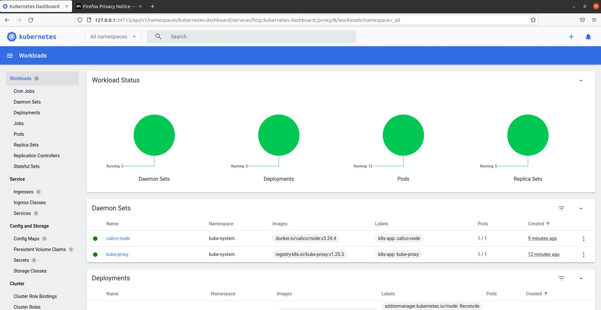
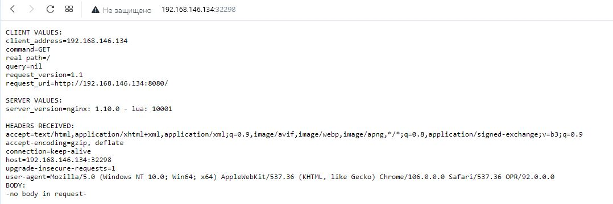

# Домашнее задание к занятию "12.1 Компоненты Kubernetes"

Вы DevOps инженер в крупной компании с большим парком сервисов. Ваша задача — разворачивать эти продукты в корпоративном кластере. 

## Задача 1: Установить Minikube

Для экспериментов и валидации ваших решений вам нужно подготовить тестовую среду для работы с Kubernetes. Оптимальное решение — развернуть на рабочей машине Minikube.

### Как поставить на AWS:
- создать EC2 виртуальную машину (Ubuntu Server 20.04 LTS (HVM), SSD Volume Type) с типом **t3.small**. Для работы потребуется настроить Security Group для доступа по ssh. Не забудьте указать keypair, он потребуется для подключения.
- подключитесь к серверу по ssh (ssh ubuntu@<ipv4_public_ip> -i <keypair>.pem)
- установите миникуб и докер следующими командами:
  - curl -LO https://storage.googleapis.com/kubernetes-release/release/`curl -s https://storage.googleapis.com/kubernetes-release/release/stable.txt`/bin/linux/amd64/kubectl
  - chmod +x ./kubectl
  - sudo mv ./kubectl /usr/local/bin/kubectl
  - sudo apt-get update && sudo apt-get install docker.io conntrack -y
  - curl -Lo minikube https://storage.googleapis.com/minikube/releases/latest/minikube-linux-amd64 && chmod +x minikube && sudo mv minikube /usr/local/bin/
- проверить версию можно командой minikube version
- переключаемся на root и запускаем миникуб: minikube start --vm-driver=none
- после запуска стоит проверить статус: minikube status
- запущенные служебные компоненты можно увидеть командой: kubectl get pods --namespace=kube-system

```commandline
nton@DevOps:~/Desktop/12-kubernetes-01-intro$ minikube version
minikube version: v1.27.1
commit: fe869b5d4da11ba318eb84a3ac00f336411de7ba
```
```commandline
anton@DevOps:~/Desktop/12-kubernetes-01-intro$ sudo minikube status
minikube
type: Control Plane
host: Running
kubelet: Running
apiserver: Running
kubeconfig: Configured
```

- Install calico network plugin on Minikube 
```commandline
curl https://docs.projectcalico.org/manifests/calico-typha.yaml -o calico.yaml
kubectl apply -f calico.yaml
```

```commandline
anton@ubuntu:~/Desktop/HW/cri-dockerd$ sudo kubectl get pods --namespace=kube-system
NAME                                      READY   STATUS    RESTARTS   AGE
calico-kube-controllers-f79f7749d-ngjxq   1/1     Running   0          25s
calico-node-4f5jx                         1/1     Running   0          25s
calico-typha-69668544f4-v7p7c             1/1     Running   0          25s
coredns-565d847f94-qswrl                  1/1     Running   0          3m58s
etcd-ubuntu                               1/1     Running   0          4m12s
kube-apiserver-ubuntu                     1/1     Running   0          4m12s
kube-controller-manager-ubuntu            1/1     Running   0          4m12s
kube-proxy-hr7rn                          1/1     Running   0          3m59s
kube-scheduler-ubuntu                     1/1     Running   0          4m12s
storage-provisioner                       1/1     Running   0          4m10s
```

### Для сброса кластера стоит удалить кластер и создать заново:
- minikube delete
- minikube start --vm-driver=none

Возможно, для повторного запуска потребуется выполнить команду: sudo sysctl fs.protected_regular=0

Инструкция по установке Minikube - [ссылка](https://kubernetes.io/ru/docs/tasks/tools/install-minikube/)

**Важно**: t3.small не входит во free tier, следите за бюджетом аккаунта и удаляйте виртуалку.

## Задача 2: Запуск Hello World
После установки Minikube требуется его проверить. Для этого подойдет стандартное приложение hello world. А для доступа к нему потребуется ingress.

- развернуть через Minikube тестовое приложение по [туториалу](https://kubernetes.io/ru/docs/tutorials/hello-minikube/#%D1%81%D0%BE%D0%B7%D0%B4%D0%B0%D0%BD%D0%B8%D0%B5-%D0%BA%D0%BB%D0%B0%D1%81%D1%82%D0%B5%D1%80%D0%B0-minikube)
- установить аддоны ingress и dashboard

```commandline
nton@ubuntu:~/Desktop/HW/cri-dockerd$ sudo kubectl get deployments
NAME         READY   UP-TO-DATE   AVAILABLE   AGE
hello-node   1/1     1            1           14s
anton@ubuntu:~/Desktop/HW/cri-dockerd$ sudo kubectl get pods
NAME                         READY   STATUS    RESTARTS   AGE
hello-node-697897c86-9dsc5   1/1     Running   0          34s

```
```commandline
anton@ubuntu:~/Desktop/HW/cri-dockerd$ sudo kubectl expose deployment hello-node --type=LoadBalancer --port=8080
service/hello-node exposed

anton@ubuntu:~/Desktop/HW/cri-dockerd$ sudo kubectl get services
NAME         TYPE           CLUSTER-IP      EXTERNAL-IP   PORT(S)          AGE
hello-node   LoadBalancer   10.98.119.113   <pending>     8080:32298/TCP   14s
kubernetes   ClusterIP      10.96.0.1       <none>        443/TCP          18m
anton@ubuntu:~/Desktop/HW/cri-dockerd$ sudo minikube service hello-node
|-----------|------------|-------------|------------------------------|
| NAMESPACE |    NAME    | TARGET PORT |             URL              |
|-----------|------------|-------------|------------------------------|
| default   | hello-node |        8080 | http://192.168.146.134:32298 |
|-----------|------------|-------------|------------------------------|
```

```commandline
anton@ubuntu:~/Desktop/HW/cri-dockerd$ sudo minikube addons enable metrics-server
anton@ubuntu:~/Desktop/HW/cri-dockerd$ sudo minikube addons enable ingress

anton@ubuntu:~/Desktop/HW/cri-dockerd$ sudo minikube addons list
|-----------------------------|----------|--------------|--------------------------------|
|         ADDON NAME          | PROFILE  |    STATUS    |           MAINTAINER           |
|-----------------------------|----------|--------------|--------------------------------|
| ambassador                  | minikube | disabled     | 3rd party (Ambassador)         |
| auto-pause                  | minikube | disabled     | Google                         |
| cloud-spanner               | minikube | disabled     | Google                         |
| csi-hostpath-driver         | minikube | disabled     | Kubernetes                     |
| dashboard                   | minikube | enabled ✅   | Kubernetes                     |
| default-storageclass        | minikube | enabled ✅   | Kubernetes                     |
| efk                         | minikube | disabled     | 3rd party (Elastic)            |
| freshpod                    | minikube | disabled     | Google                         |
| gcp-auth                    | minikube | disabled     | Google                         |
| gvisor                      | minikube | disabled     | Google                         |
| headlamp                    | minikube | disabled     | 3rd party (kinvolk.io)         |
| helm-tiller                 | minikube | disabled     | 3rd party (Helm)               |
| inaccel                     | minikube | disabled     | 3rd party (InAccel             |
|                             |          |              | [info@inaccel.com])            |
| ingress                     | minikube | enabled ✅   | Kubernetes                     |
| ingress-dns                 | minikube | disabled     | Google                         |
| istio                       | minikube | disabled     | 3rd party (Istio)              |
| istio-provisioner           | minikube | disabled     | 3rd party (Istio)              |
| kong                        | minikube | disabled     | 3rd party (Kong HQ)            |
| kubevirt                    | minikube | disabled     | 3rd party (KubeVirt)           |
| logviewer                   | minikube | disabled     | 3rd party (unknown)            |
| metallb                     | minikube | disabled     | 3rd party (MetalLB)            |
| metrics-server              | minikube | enabled ✅   | Kubernetes                     |
| nvidia-driver-installer     | minikube | disabled     | Google                         |
| nvidia-gpu-device-plugin    | minikube | disabled     | 3rd party (Nvidia)             |
| olm                         | minikube | disabled     | 3rd party (Operator Framework) |
| pod-security-policy         | minikube | disabled     | 3rd party (unknown)            |
| portainer                   | minikube | disabled     | 3rd party (Portainer.io)       |
| registry                    | minikube | disabled     | Google                         |
| registry-aliases            | minikube | disabled     | 3rd party (unknown)            |
| registry-creds              | minikube | disabled     | 3rd party (UPMC Enterprises)   |
| storage-provisioner         | minikube | enabled ✅   | Google                         |
| storage-provisioner-gluster | minikube | disabled     | 3rd party (Gluster)            |
| volumesnapshots             | minikube | disabled     | Kubernetes                     |
|-----------------------------|----------|--------------|--------------------------------|

```


```
anton@ubuntu:~/Desktop/HW/cri-dockerd$ sudo kubectl get pod,svc -n kube-system
NAME                                          READY   STATUS    RESTARTS   AGE
pod/calico-kube-controllers-f79f7749d-ngjxq   1/1     Running   0          20m
pod/calico-node-4f5jx                         1/1     Running   0          20m
pod/calico-typha-69668544f4-v7p7c             1/1     Running   0          20m
pod/coredns-565d847f94-qswrl                  1/1     Running   0          24m
pod/etcd-ubuntu                               1/1     Running   0          24m
pod/kube-apiserver-ubuntu                     1/1     Running   0          24m
pod/kube-controller-manager-ubuntu            1/1     Running   0          24m
pod/kube-proxy-hr7rn                          1/1     Running   0          24m
pod/kube-scheduler-ubuntu                     1/1     Running   0          24m
pod/metrics-server-769cd898cd-h6wfb           1/1     Running   0          98s
pod/storage-provisioner                       1/1     Running   0          24m

NAME                     TYPE        CLUSTER-IP      EXTERNAL-IP   PORT(S)                  AGE
service/calico-typha     ClusterIP   10.100.204.96   <none>        5473/TCP                 20m
service/kube-dns         ClusterIP   10.96.0.10      <none>        53/UDP,53/TCP,9153/TCP   24m
service/metrics-server   ClusterIP   10.103.102.15   <none>        443/TCP                  98s

```




## Задача 3: Установить kubectl

Подготовить рабочую машину для управления корпоративным кластером. Установить клиентское приложение kubectl.
- подключиться к minikube 
- проверить работу приложения из задания 2, запустив port-forward до кластера

- ./kubectl запускал с Win
- 
```commandline
PS C:\Users\must-\Desktop\HW> ./kubectl get services
NAME         TYPE           CLUSTER-IP      EXTERNAL-IP   PORT(S)          AGE
hello-node   LoadBalancer   10.98.119.113   <pending>     8080:32298/TCP   115m
kubernetes   ClusterIP      10.96.0.1       <none>        443/TCP          134m
PS C:\Users\must-\Desktop\HW>
                              ./kubectl get services
NAME         TYPE           CLUSTER-IP      EXTERNAL-IP   PORT(S)          AGE
hello-node   LoadBalancer   10.98.119.113   <pending>     8080:32298/TCP   117m
kubernetes   ClusterIP      10.96.0.1       <none>        443/TCP          135m
PS C:\Users\must-\Desktop\HW> ./kubectl get nodes
NAME     STATUS   ROLES           AGE    VERSION
ubuntu   Ready    control-plane   139m   v1.25.3
PS C:\Users\must-\Desktop\HW> ./kubectl get pods
NAME                         READY   STATUS    RESTARTS      AGE
hello-node-697897c86-9dsc5   1/1     Running   2 (77m ago)   125m
```

## Задача 4 (*): собрать через ansible (необязательное)

Профессионалы не делают одну и ту же задачу два раза. Давайте закрепим полученные навыки, автоматизировав выполнение заданий  ansible-скриптами. При выполнении задания обратите внимание на доступные модули для k8s под ansible.
 - собрать роль для установки minikube на aws сервисе (с установкой ingress)
 - собрать роль для запуска в кластере hello world
  
  ---

### Как оформить ДЗ?

Выполненное домашнее задание пришлите ссылкой на .md-файл в вашем репозитории.

---