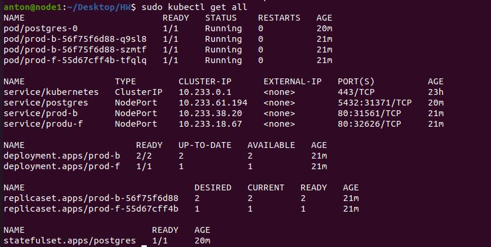

# Домашнее задание к занятию "13.1 контейнеры, поды, deployment, statefulset, services, endpoints"
Настроив кластер, подготовьте приложение к запуску в нём. Приложение стандартное: бекенд, фронтенд, база данных. Его можно найти в папке 13-kubernetes-config.

## Задание 1: подготовить тестовый конфиг для запуска приложения
Для начала следует подготовить запуск приложения в stage окружении с простыми настройками. Требования:
* под содержит в себе 2 контейнера — фронтенд, бекенд;
* регулируется с помощью deployment фронтенд и бекенд;
* база данных — через statefulset.

```commandline
sudo apt install nfs-kernel-server

anton@VM-DEVOPS:~/Desktop/HW/13.1$ sudo mkdir /var/nfs
anton@VM-DEVOPS:~/Desktop/HW/13.1$ sudo nano /etc/exports
anton@VM-DEVOPS:~/Desktop/HW/13.1$ sudo exportfs -a
anton@VM-DEVOPS:~/Desktop/HW/13.1$ sudo ufw allow 111
Rules updated
Rules updated (v6)
anton@VM-DEVOPS:~/Desktop/HW/13.1$ sudo ufw allow 2049
Rules updated
Rules updated (v6)
```
- [stage.yaml](./yaml_1/stage.yaml)
- [stagePG.yaml](./yaml_1/stagePG.yaml)
```commandline
anton@node1:~/Desktop/HW$ sudo kubectl create -f stage.yaml 
deployment.apps/fb-pod created
service/fb-svc created
anton@node1:~/Desktop/HW$ sudo kubectl create -f stagePG.yaml 
statefulset.apps/postgres-db created
anton@node1:~/Desktop/HW$ sudo kubectl get po
NAME                      READY   STATUS    RESTARTS   AGE
fb-pod-6d584588ff-v48rn   2/2     Running   0          72s
postgres-db-0             1/1     Running   0          60s
anton@node1:~/Desktop/HW$ sudo kubectl get deploy
NAME     READY   UP-TO-DATE   AVAILABLE   AGE
fb-pod   1/1     1            1           5m44s
anton@node1:~/Desktop/HW$ sudo kubectl get statefulset
NAME          READY   AGE
postgres-db   1/1     4m6s
```
## Задание 2: подготовить конфиг для production окружения
Следующим шагом будет запуск приложения в production окружении. Требования сложнее:
* каждый компонент (база, бекенд, фронтенд) запускаются в своем поде, регулируются отдельными deployment’ами;
* для связи используются service (у каждого компонента свой);
* в окружении фронта прописан адрес сервиса бекенда;
* в окружении бекенда прописан адрес сервиса базы данных.

- [front.yaml](./yaml_2/front.yaml)
- [back.yaml](./yaml_2/back.yaml)
- [PG.yaml](./yaml_2/PG.yaml)

```commandline
anton@node1:~/Desktop/HW$ sudo kubectl create -f front.yaml 
[sudo] password for anton: 
deployment.apps/prod-f created
service/produ-f created
anton@node1:~/Desktop/HW$ sudo kubectl create -f back.yaml 
deployment.apps/prod-b created
service/prod-b created
anton@node1:~/Desktop/HW$ sudo kubectl create -f PG.yaml 
statefulset.apps/postgres created
configmap/postgres-config created
service/postgres created
persistentvolume/nfs-pv-prod created
```



## Задание 3 (*): добавить endpoint на внешний ресурс api
Приложению потребовалось внешнее api, и для его использования лучше добавить endpoint в кластер, направленный на это api. Требования:
* добавлен endpoint до внешнего api (например, геокодер).

---

### Как оформить ДЗ?

Выполненное домашнее задание пришлите ссылкой на .md-файл в вашем репозитории.

В качестве решения прикрепите к ДЗ конфиг файлы для деплоя. Прикрепите скриншоты вывода команды kubectl со списком запущенных объектов каждого типа (pods, deployments, statefulset, service) или скриншот из самого Kubernetes, что сервисы подняты и работают.

---