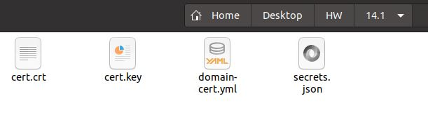

# Домашнее задание к занятию "14.1 Создание и использование секретов"

## Задача 1: Работа с секретами через утилиту kubectl в установленном minikube

Выполните приведённые ниже команды в консоли, получите вывод команд. Сохраните
задачу 1 как справочный материал.

### Как создать секрет?

```
openssl genrsa -out cert.key 4096
openssl req -x509 -new -key cert.key -days 3650 -out cert.crt \
-subj '/C=RU/ST=Moscow/L=Moscow/CN=server.local'
kubectl create secret tls domain-cert --cert=certs/cert.crt --key=certs/cert.key
```

### Как просмотреть список секретов?

```
kubectl get secrets
kubectl get secret
```
```commandline
anton@node1:~/Desktop/HW/14.1$ sudo kubectl get secrets
NAME          TYPE                DATA   AGE
domain-cert   kubernetes.io/tls   2      18s
anton@node1:~/Desktop/HW/14.1$ sudo kubectl get secret
NAME          TYPE                DATA   AGE
domain-cert   kubernetes.io/tls   2      25s
```

### Как просмотреть секрет?

```
kubectl get secret domain-cert
kubectl describe secret domain-cert
```

```commandline
kubectl get secret domain-cert
NAME          TYPE                DATA   AGE
domain-cert   kubernetes.io/tls   2      4m13s
--------
kubectl describe secret domain-cert
Name:         domain-cert
Namespace:    default
Labels:       <none>
Annotations:  <none>

Type:  kubernetes.io/tls

Data
====
tls.crt:  1944 bytes
tls.key:  3247 bytes
```

### Как получить информацию в формате YAML и/или JSON?

```
kubectl get secret domain-cert -o yaml
kubectl get secret domain-cert -o json
```

```commandline
kubectl get secret domain-cert -o yaml
apiVersion: v1
data:
  tls.crt: LS0tLS1CRUdJTiBDRVJUSUZJQ0FURS0tLS0tCk1J...SUZiV
  tls.key: LS0tLS1CRUdJTiBSU0EgUFJJVkFURSBLRVktLS0t...LQpNS==
kind: Secret
metadata:
  creationTimestamp: "2022-12-11T13:07:21Z"
  name: domain-cert
  namespace: default
  resourceVersion: "191014"
  uid: 21a3473f-b43a-426e-b87f-01cdf6854b8a
type: kubernetes.io/tls
```

```commandline
kubectl get secret domain-cert -o json
{
    "apiVersion": "v1",
    "data": {
        "tls.crt": "LS0tLS1CRUdJTiBDRVJUSUZJQ0FURS0tLS0tCk1J...SUZiV",
        "tls.key": "LS0tLS1CRUdJTiBSU0EgUFJJVkFURSBLRVktLS0t...LQpNS=="
    },
    "kind": "Secret",
    "metadata": {
        "creationTimestamp": "2022-12-11T13:07:21Z",
        "name": "domain-cert",
        "namespace": "default",
        "resourceVersion": "191014",
        "uid": "21a3473f-b43a-426e-b87f-01cdf6854b8a"
    },
    "type": "kubernetes.io/tls"
}
```

### Как выгрузить секрет и сохранить его в файл?

```
kubectl get secrets -o json > secrets.json
kubectl get secret domain-cert -o yaml > domain-cert.yml
```



### Как удалить секрет?

```
kubectl delete secret domain-cert
```
```commandline
sudo kubectl delete secret domain-cert
secret "domain-cert" deleted
```
### Как загрузить секрет из файла?

```
kubectl apply -f domain-cert.yml
```

```commandline
kubectl apply -f domain-cert.yml
secret/domain-cert created

kubectl get secrets
NAME          TYPE                DATA   AGE
domain-cert   kubernetes.io/tls   2      5s
```

## Задача 2 (*): Работа с секретами внутри модуля

Выберите любимый образ контейнера, подключите секреты и проверьте их доступность
как в виде переменных окружения, так и в виде примонтированного тома.

В виде переменных окружения
```yaml
---
apiVersion: v1
kind: Secret
metadata:
  name: my-pass
type: Opaque
data:
  password: UGFzc3cwcmQ=
---
apiVersion: v1
kind: Pod
metadata:
  name: k8s-nginx
  labels:
    name: k8s-nginx
spec:
  containers:
  - name: nginx
    image: nginx:latest
    env:
    - name: MY_ROOT_PASSWORD
      valueFrom:
        secretKeyRef:
          name: my-pass
          key: password
    ports:
    - name: mysql
      containerPort: 80
      protocol: TCP
```

---

### Как оформить ДЗ?

Выполненное домашнее задание пришлите ссылкой на .md-файл в вашем репозитории.

В качестве решения прикрепите к ДЗ конфиг файлы для деплоя. Прикрепите скриншоты вывода команды kubectl со списком запущенных объектов каждого типа (deployments, pods, secrets) или скриншот из самого Kubernetes, что сервисы подняты и работают, а также вывод из CLI.

---